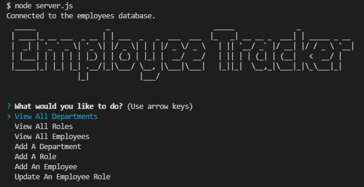

# SQL Employee Tracker

  ## License
  

  ## Description
A command-line application to manage a company's employee database, using Node.js, Inquirer, and MySQL.

  ### Screenshots
  

  ### Walkthrough Video

  

  [Click here for link](https://drive.google.com/file/d/1_2tdnLypuK6cWjr-_oKwKg2eVie1tX9j/view)

  ## Table of Contents
  * [Installation](#installation)
  * [Usage](#usage)
  * [Contributing](#contributing)
  * [Questions](#questions)
        
  ## Installation
Enter `npm install` to install the necessary dependencies.
   
  ## Usage
Enter `node server.js` in the terminal and answer the prompts.

  ## Contributing
Charity Rogers

  ## Questions
If you have any questions, please contact me!

  - GitHub: https://github.com/rogerscl116
  - Email: rogerscl116@gmail.com 
